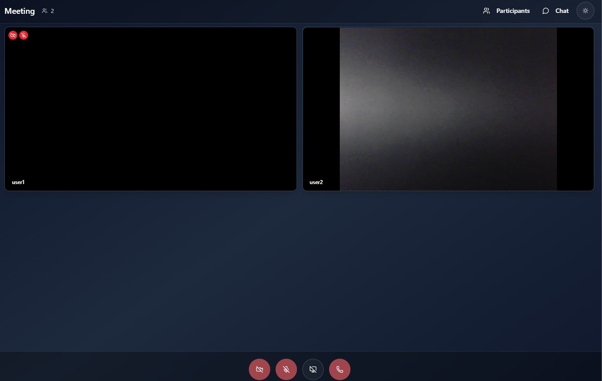
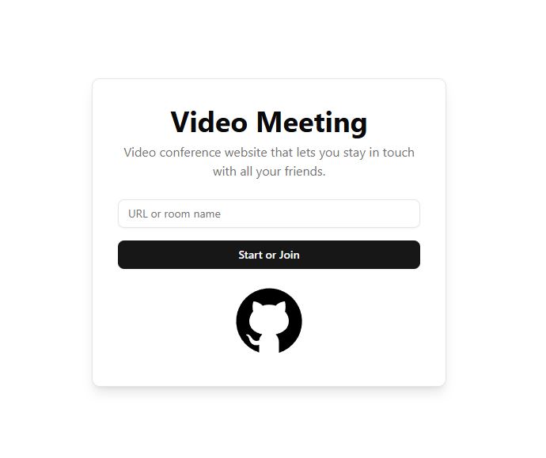
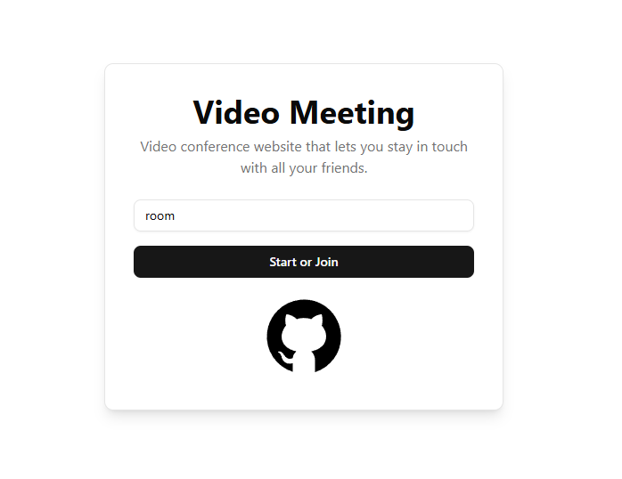
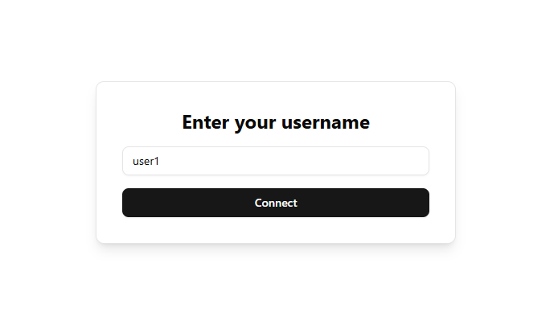
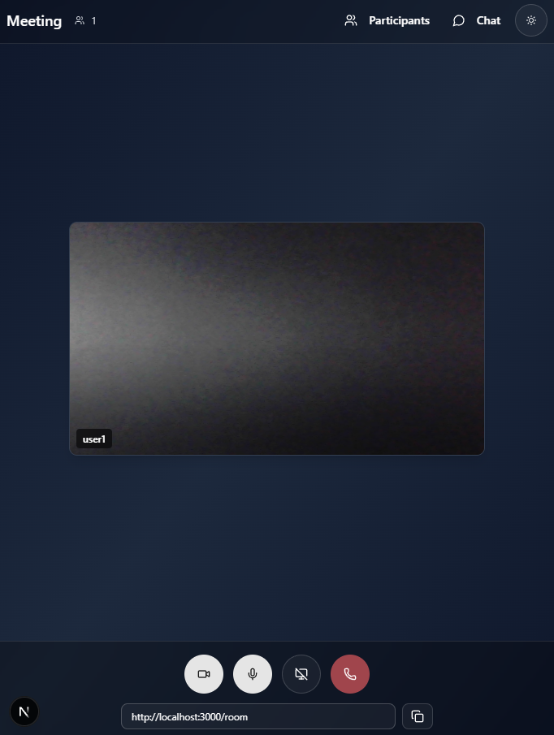
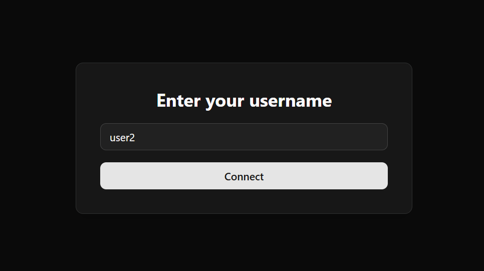
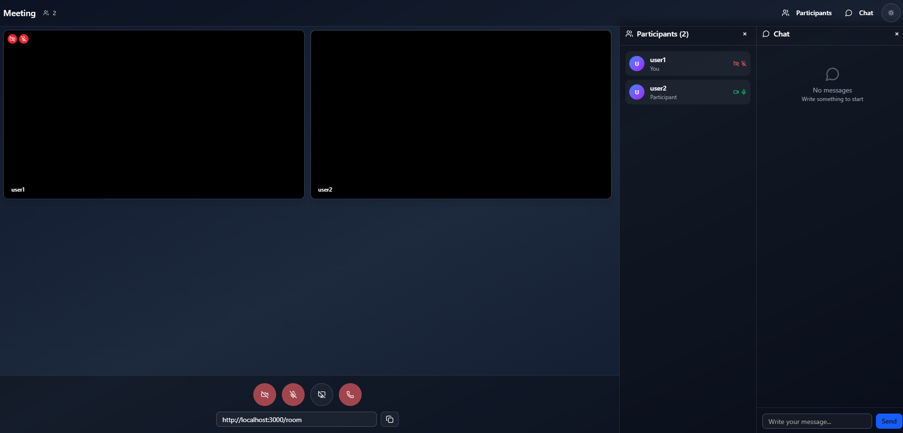
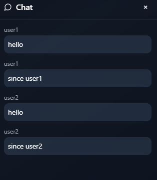

# Video Meeting (Next.js + TypeScript + TailwindCSS + shadcn/ui)

This project is a modern migration of the video calling app, built with:

- **Next.js (App Router)**
- **TypeScript**
- **TailwindCSS**
- **shadcn/ui**
- **Socket.IO**

<p align="center">
  
</p>

<br>
<br>
<br>
<br>

-----

<p align="center">
  
</p>

<p align="center">
  
</p>

<p align="center">
  
</p>

<p align="center">
  
</p>

<p align="center">
  
</p>

<p align="center">
  
</p>

<p align="center">
  
</p>

<p align="center">
  
</p>


## Scripts

```bash
npm run dev      # Start development server (Next.js + Socket.IO)
npm run build    # Build the app for production
npm run start    # Start the app in production mode
```

## Structure

- `/src/app` → Main pages and routes (Next.js App Router)
- `/src/components` → Reusable components
- `/server.js` → Socket.IO server for signaling

## How to Use

1. Install dependencies: `npm install`
2. Run the project: `npm run dev`
3. Open http://localhost:3000 in your browser
4. Enter your name and join a room
5. Share the link with other users to join

## Features

- ✅ Real-time chat
- ✅ Video and audio
- ✅ Screen sharing
- ✅ Copy room link
- ✅ Multiple users
- ✅ Responsive design


## 🤝 Contributing

Contributions are welcome! Please feel free to submit a Pull Request.

1. Fork the repository
2. Create your feature branch (`git checkout -b feature/AmazingFeature`)
3. Commit your changes (`git commit -m 'Add some AmazingFeature'`)
4. Push to the branch (`git push origin feature/AmazingFeature`)
5. Open a Pull Request

## 📄 License

This project is licensed under the MIT License - see the [LICENSE](LICENSE) file for details.

# Inspiration

This project was inspired by the [Video Meeting](https://github.com/0x5eba/Video-Meeting) project.

----

Created by [Diego Ivan Perea Montealegre](https://github.com/diegoperea20)